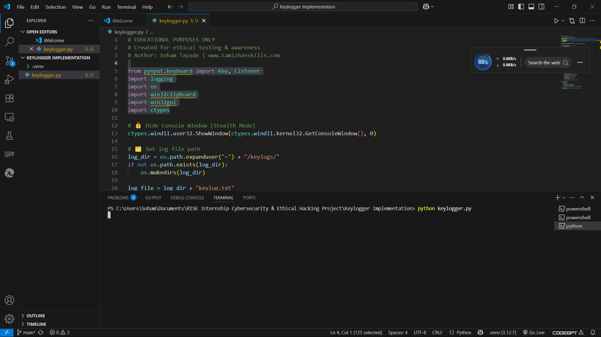
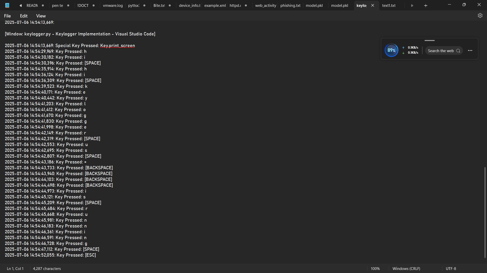

# 🧠 Keylogger – Educational Project

> ⚠️ **For Educational and Ethical Testing Purposes Only**

A Python-based keylogger tool that captures keystrokes and logs them into a text file.  
This project is intended to demonstrate how keystroke logging works for **ethical awareness, training, and testing** in cybersecurity environments.

---
## ✨ Features

- ⌨️ Logs all standard key presses (letters, numbers, symbols)
- 📁 Stores logs in a hidden folder in user's home directory
- 🛑 Stops logging when ESC key is pressed
- 🧪 Demonstrates real-world keylogging behavior for learning purposes
- 💻 Lightweight and runs in the background
---
## 🛠️ Technologies Used

- 🐍 Python 3.x
- 🎯 [pynput](https://pypi.org/project/pynput/) – For listening to keyboard events
- 🗂️ logging module – For saving key logs with timestamps

💡 The logs will be stored in:
C:/Users/<YourUsername>/keylogs/keylog.txt
🔑 To stop the logger: Press the ESC key.

---

## 📸 Screenshots

### 🔹 Script Running in Terminal

### 🔹 Generated Keylog Output

## 🎬 Project Demo (Voice-over)

📽️ Watch the complete working demo with explanation:  
👉 [Click to Watch Demo on Google Drive](https://drive.google.com/file/d/1AnbJfn0IfItNJf6TrMCYphfrvTJ5-act/view?usp=drive_link)

## 🚀 Future Enhancements

- 🔒 Add log encryption
- ☁️ Upload logs to remote server for testing
- 🛑 Add keystroke filtering (ignore function keys, etc.)

## 👨‍💻 Author

**Soham Pramod Tayade**  
🎓 BSc Cyber & Digital Science  
🏢 RISE Internship – Cybersecurity & Ethical Hacking  
📍 Pune, Maharashtra  
🔗 GitHub: [Dozkiller04](https://github.com/Dozkiller04)

